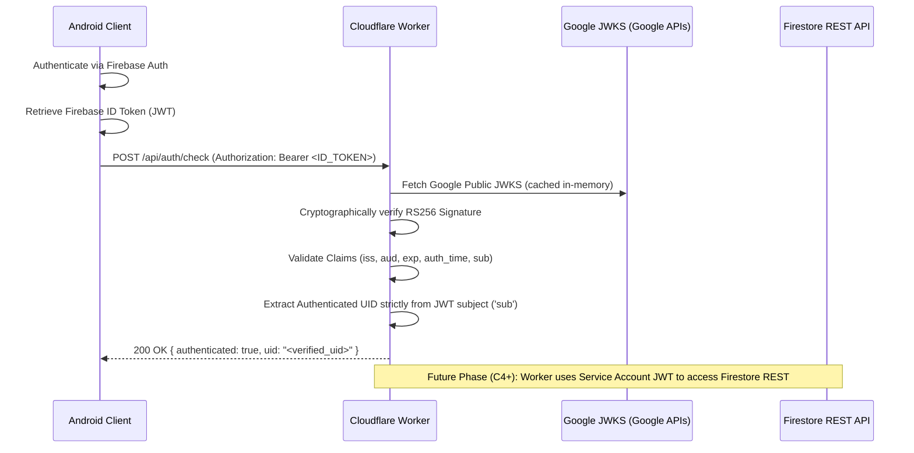

# Cloudflare Worker Backend Architecture

## 1. Overview & Purpose

Because the Nursing Super App backend cannot rely on the paid Firebase Blaze plan (which restricts Firebase Cloud Functions in production), an external serverless trusted boundary is required.

The Cloudflare Worker serves as this trusted backend boundary. It executes outside the untrusted Android client environment and acts as the gatekeeper for sensitive server-side operations, specifically future Mutual Transfer candidate matching and transaction locking.

In Phase 1.5.3C-3 (Cloudflare Worker Foundation), the Worker establishes the core cryptographic authentication boundary without implementing business or matching logic.

---

## 2. Authentication Flow

The authentication architecture enforces zero client-side privilege escalation:

1. **Client Request**: The Android client sends an HTTPS request with an `Authorization: Bearer <token>` header containing a Firebase Auth ID Token.
2. **Token Extraction**: The Cloudflare Worker extracts the Bearer token. Requests missing the token or using malformed bearer syntax are immediately rejected (`401 Unauthorized`).
3. **Cryptographic Verification**:
   - Header verification: The JWT header must specify `alg: "RS256"` and contain a valid `kid` key ID.
   - Public Key Resolution: The Worker queries Google's public JSON Web Key Set (`https://www.googleapis.com/robot/v1/metadata/x509/securetoken@system.gserviceaccount.com` or Google JWKS endpoint) and caches keys in memory with `max-age` / `s-maxage` honoring Cache-Control.
   - RS256 Verification: Utilizing the native Web Crypto API (`crypto.subtle.importKey` and `crypto.subtle.verify`), the Worker cryptographically verifies the signature against Google's public key.
4. **Claims Validation**:
   - `iss` (Issuer) must match `https://securetoken.google.com/<FIREBASE_PROJECT_ID>`.
   - `aud` (Audience) must match `<FIREBASE_PROJECT_ID>`.
   - `exp` (Expiration) must be in the future (with 60-second clock skew tolerance).
   - `iat` (Issued at) must be in the past (with 60-second clock skew tolerance).
   - `auth_time` must be in the past.
   - `sub` (Subject / UID) must be non-empty and less than 128 characters.
5. **Caller UID Trust**: The caller cannot provide an untrusted `userId` in the request body to impersonate another nurse. The verified UID is strictly derived from the verified token claim `sub`.
6. **Response**: In Phase 1.5.3C-3, the Worker responds with `{ "authenticated": true, "uid": "<verified_uid>" }`. No private transfer data or other users' transfer details are exposed.

---

## 3. Web Crypto API Implementation

Cloudflare Workers and modern Node.js environments support the standard W3C Web Crypto API (`crypto.subtle`), removing any external runtime dependencies (such as heavy third-party JWT or Node-crypto libraries):
- `crypto.subtle.importKey`: Imports RSA-OAEP / RS256 public keys from JWK representations with `["verify"]` key usages.
- `crypto.subtle.verify`: Verifies the signature bytes of `encodedHeader + "." + encodedPayload` against the decoded RS256 signature.
- `crypto.subtle.digest`: Generates SHA-256 hashes if necessary.

---

## 4. Configuration & Secrets

Environment variables and secrets are defined in `wrangler.toml` and managed via Cloudflare Dashboard / Wrangler secrets:

### Variables (Non-Secret)
- `FIREBASE_PROJECT_ID`: The Firebase project identifier (e.g. `nursing-super-app`). Validates `aud` and `iss` claims.

### Secrets (Configured via `wrangler secret put`)
- `FIREBASE_SERVICE_ACCOUNT_CLIENT_EMAIL`: Service account email with backend Firestore read/write capabilities (for future phases).
- `FIREBASE_SERVICE_ACCOUNT_PRIVATE_KEY`: Private RSA key in PEM format (never committed to version control).

> **Important**: No private keys or service account credentials are committed to the git repository. Development and test suites use ephemeral generated RSA key pairs via Web Crypto.

---

## 5. Scope Boundaries

### Strictly Implemented in Phase 1.5.3C-3:
- Standalone `/cloudflare-worker/` directory with TypeScript, `wrangler.toml`, unit tests, and type definitions.
- Endpoints:
  - `GET /health`: Health check endpoint returning `{ "status": "ok" }`.
  - `POST /api/auth/check`: Authenticates incoming Firebase ID Token and returns `{ "authenticated": true, "uid": "<verified_uid>" }`.
- Complete cryptographic test suite with 100% passing tests for valid tokens, expired tokens, wrong audience, wrong issuer, bad signatures, missing headers, and malformed tokens.

### Deferred to Future Phases (Phase 1.5.3C-4 and beyond):
- **No matching engine**: Candidate search, pairing logic, and ranked preference evaluation are not implemented in C3.
- **No Firestore mutations**: Reading or writing transfer requests, identities, or matches is deferred.
- **No match locking / timers**: Mutual match locking and 48-hour expiration timers are deferred.
- **Grade Matching Rule**: When matching logic is built in future phases, the locked business rule will be preserved:
  - Same-grade matching is **prioritized and preferred**, but **not mandatory**.
  - Cross-grade matching remains eligible if no same-grade match is available.
  - Grade is matching metadata / scoring information, NOT a hard rejection filter.
